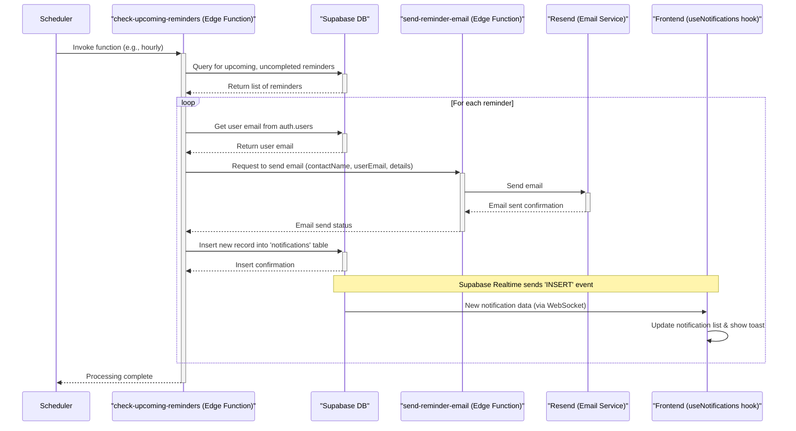

# Notification Flow Analysis

This document explains the notification flow for reminders in the application. The process involves a backend Supabase Edge Function (`check-upcoming-reminders`) that identifies due reminders, triggers email and in-app notifications, and a frontend hook (`useNotifications`) to display these in-app notifications in real-time.

## Flow Breakdown

**1. Triggering the Notification Check (Backend)**

*   The core of the process is the Supabase Edge Function located at `supabase/functions/check-upcoming-reminders/index.ts`.
*   **How it's triggered:** This function needs to be run periodically (e.g., once every few minutes or hourly) to check for upcoming reminders. The `supabase/config.toml` file doesn't specify a schedule, which means this function is likely invoked by:
    *   A cron job configured directly in your Supabase project's database (using `pg_cron`).
    *   An external scheduler like a GitHub Action, a Vercel Cron Job, or a similar service that calls the function's HTTP endpoint.
    *   *Note: The exact scheduling mechanism should be verified in the Supabase project settings or external service configurations.*

**2. Identifying Due Reminders (Backend - `check-upcoming-reminders`)**

*   When executed, this function:
    *   Calculates the date range for "today" and "tomorrow."
    *   Queries the `reminders` table in your Supabase database.
    *   It looks for reminders that:
        *   Are scheduled between the current time and 24 hours from now (`.gte("date", todayStr)` and `.lte("date", tomorrowStr)`).
        *   Are not yet marked as completed (`.eq("is_completed", false)`).
    *   It also fetches associated contact details (`contacts(name, email)`) and the `user_id` for each reminder.

**3. Processing Each Upcoming Reminder (Backend - `check-upcoming-reminders`)**

*   For each upcoming reminder found, the function attempts to do two things: send an email and create an in-app notification.
*   **User Email Retrieval:** It first fetches the email address of the user associated with the reminder from the `auth.users` table using the `user_id`.

**4. Sending Email Notifications (Backend)**

*   The `check-upcoming-reminders` function calls another Supabase Edge Function: `supabase/functions/send-reminder-email/index.ts`.
*   This `send-reminder-email` function:
    *   Receives details like the contact's name, recipient's email (the user's email), reminder date/time, and purpose.
    *   Uses the **Resend** email service (configured with `RESEND_API_KEY`) to send an HTML email to the user.
    *   The email content includes details about the reminder.

**5. Creating In-App Notifications (Backend & Frontend)**

*   **Backend (`check-upcoming-reminders`):**
    *   After attempting to send the email, the function creates an in-app notification.
    *   It inserts a new record into the `notifications` table in your Supabase database. This record includes:
        *   `user_id`
        *   `reminder_id`
        *   `type` (e.g., "reminder\_due")
        *   `title` (e.g., "Reminder: Connect with \[Contact Name]")
        *   `message` (details about the reminder)
        *   `data` (e.g., a path like `/reminders` for navigation)
*   **Frontend (`src/hooks/use-notifications.ts`):**
    *   This custom React hook is used in your application to manage and display notifications.
    *   **Fetching Initial Notifications:** When a user is logged in, it fetches their existing notifications from the `notifications` table.
    *   **Real-time Updates:** Crucially, it subscribes to real-time changes on the `notifications` table using Supabase's `postgres_changes` feature.
        *   When the `check-upcoming-reminders` function inserts a new notification into the table for the currently logged-in user, the frontend receives this new notification instantly via the WebSocket connection.
    *   **Displaying Toast:** Upon receiving a new notification in real-time, the hook uses the `sonner` library to display a toast (a small, non-intrusive pop-up message) with the notification's title and message.
    *   The hook also updates the list of notifications, allowing UI components to display an updated count of unread notifications or list them.

## Visual Flow Diagram

## Key Points

*   **Decoupled Functions:** The system uses separate Edge Functions for checking reminders and sending emails.
*   **Real-time Frontend Updates:** Supabase real-time subscriptions ensure users see in-app notifications immediately.
*   **External Email Service:** Email delivery is handled by Resend.
*   **Trigger is External/Implicit:** The periodic execution of `check-upcoming-reminders` is crucial and managed outside the function's code itself.
